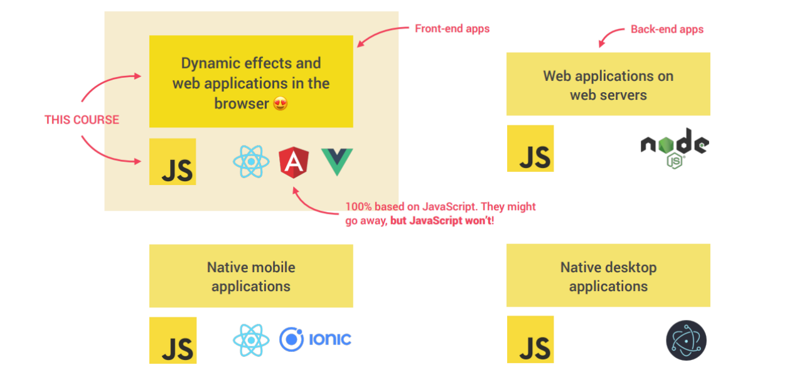
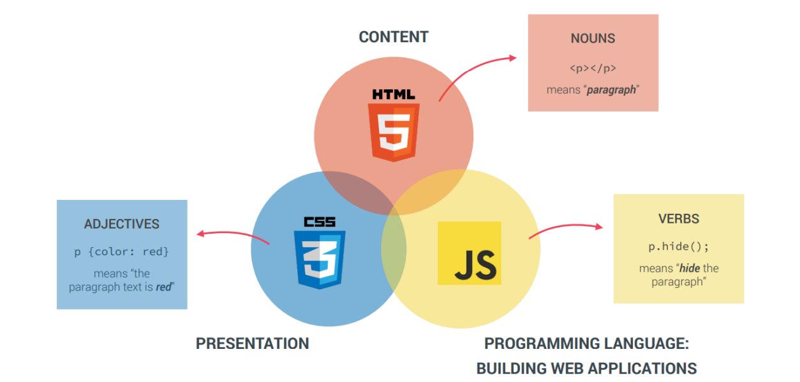
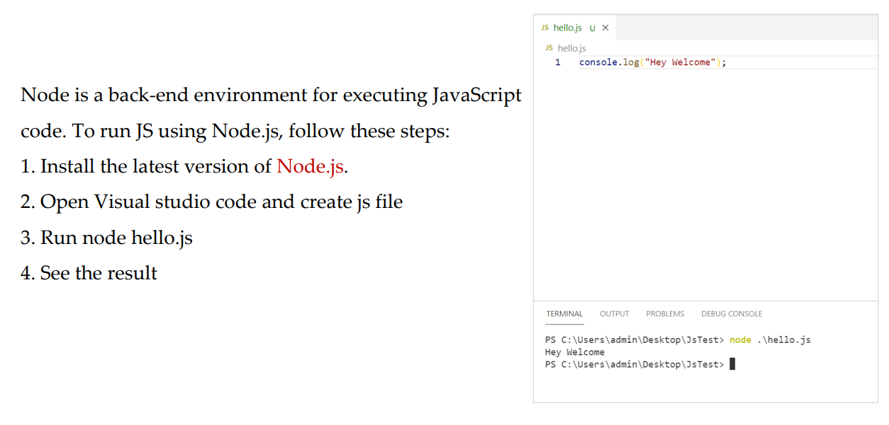
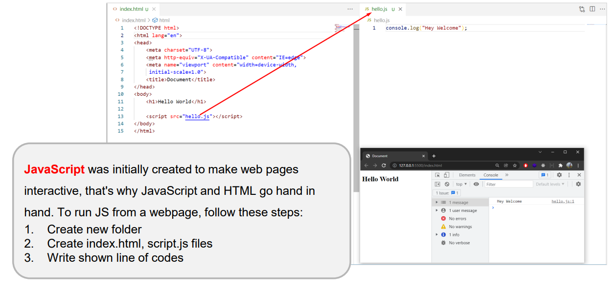
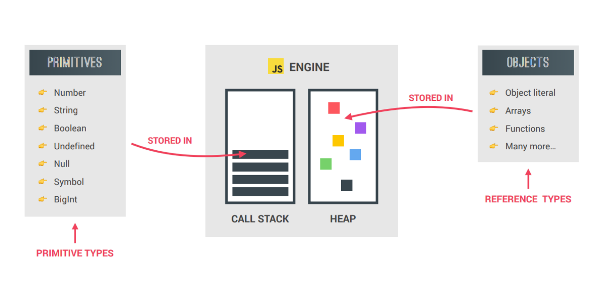
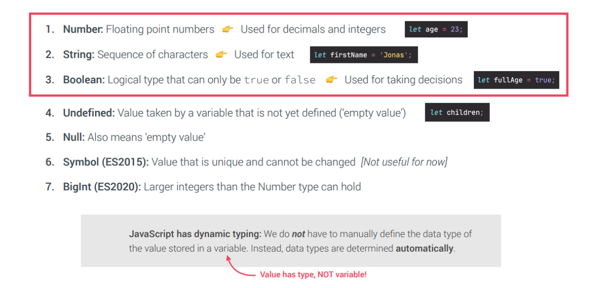
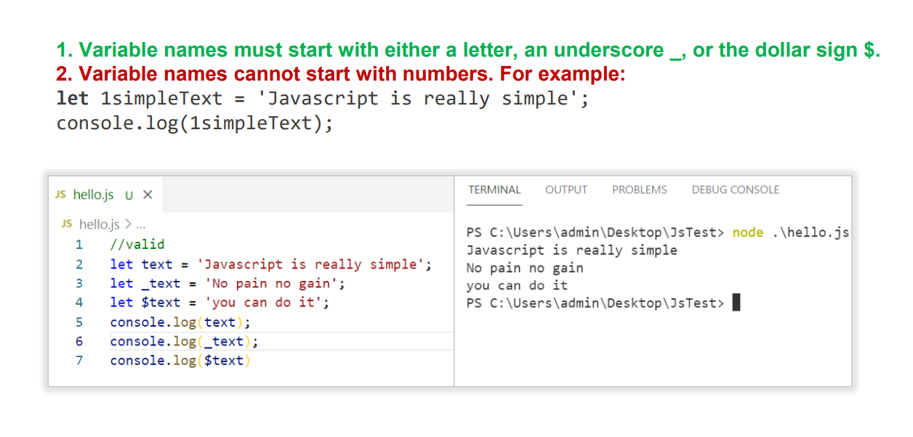

#_Javascript_
___
###JavaScript is a popular programming language that has a wide rangefapplications.
###JavaScript was previously used mainly for making webpages interactive such as form validation, animation, etc. Nowadays,
###JavaScript is also used in many other areas such as server-side development, mobile app development and so on.

***
> # JavaScript is also used in many other areas.
>>
***
> # THE ROLE OF JAVASCRIPT IN WEB DEVELOPMENT.
>>
***
> # Using Node.js
>>
***
> # By creating web pages 
>>
***
> # OBJECTS AND PRIMITIVES
>>
***
> # THE 7 primitive data types
>>
***
> # Rules for Naming JavaScript Variables
>>